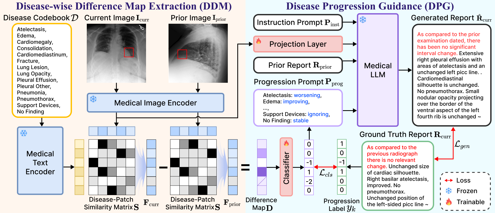

## Diff-RRG: Longitudinal Disease-wise Patch Difference as Guidance for LLM-based Radiology Report Generation (MICCAI'25)

<p align="center">
  
</p>

<p align="center">
  <em>Overview of the proposed Diff-RRG framework.</em>
</p>

### Getting Started
### Installation

**1. Prepare the code and the environment**

1. Git clone our repository and create a new conda environment.
```bash
cd Diff-RRG
conda create -n diffrrg python=3.9 -y
conda activate diffrrg
```
2. Install the requirements.
```bash
pip install -r requirements.txt
```

**2. Prepare the training dataset**

**Longitudinal-MIMIC**: you can download this dataset from [Here](https://github.com/CelestialShine/Longitudinal-Chest-X-Ray) and download the images from [Official website](https://physionet.org/content/mimic-cxr-jpg/2.1.0/)

We provide the annotation file for disease progression of Longitudinal-MIMIC dataset. You can download it from [Here](https://drive.google.com/file/d/1iWzqLfuQ_0lHE1RYf57KRt6bDwicJOeH/view?usp=sharing).

**Disease progression labels.** The `disease_progression` field is generated by comparing each study with its prior. We use the [CheXbert](https://github.com/stanfordmlgroup/CheXbert) labeler to extract disease labels for both the current and the prior study, then map the change in each disease's state as follows:

| Value | Progression state | Meaning |
|:-----:|:-----------------:|---------|
| `0`  | stable    | The state is unchanged between the prior and current study |
| `1`  | worsening | Absent in the prior study, present in the current study |
| `-1` | improving | Present in the prior study, absent in the current study |

After downloading the data and the annotation, place them in the `./data` folder.


### Training

```bash
bash scripts/1-1.mimic_train.sh
```

### Testing
You can download our pretrained Delta checkpoints from [Here](https://drive.google.com/file/d/1jWBIdZDH2950DdInCCKNhGLiR5iIEz2E/view?usp=sharing)

```bash
bash scripts/1-2.mimic_test.sh
```

## Acknowledgement

+ [R2GenGPT](https://github.com/wang-zhanyu/R2GenGPT)
+ [BiomedCLIP](https://github.com/microsoft/BiomedCLIP_data_pipeline)
+ [BioMistral](https://github.com/BioMistral/BioMistral)


## License
This repository is under [BSD 3-Clause License](LICENSE.md).
